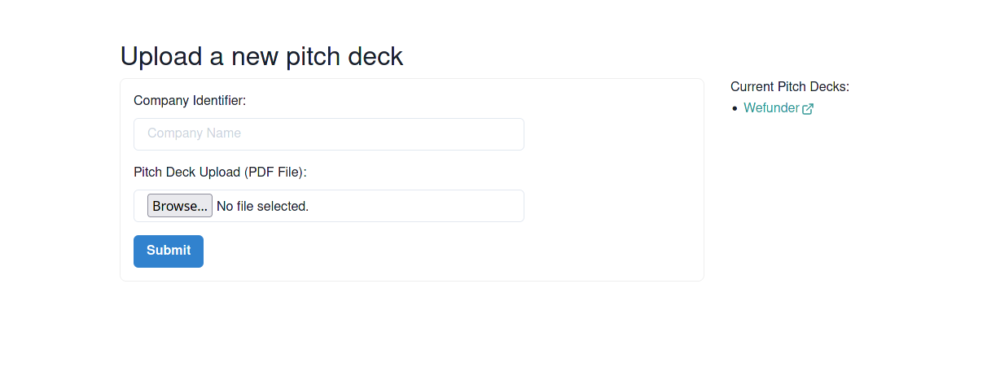

# Simple Pitch Deck Upload Application

Base tech stack: `PHP`+`Lumen`; `Typescript`+`React`+`Chakra UI`.

Under the hood, the Ghostscript program is also used by the pdf-box PHP module to convert PDF into images. Make sure it is installed on your computer by running `gs -v`.

## Get started

### Pre requisites
You'll need to have installed in your machine: `PHP 7.4+`, `composer 2.2+`, `GPL Ghostscript 9.50+ (gs)` and `Yarn 1.22+`.

### Running the project
To spin up the project, you'll need to run the backend and frontend separately.

#### Backend
In a terminal tab, run:

`composer install`

and then

`php -S localhost:8000 -t public`

and that's it. Your API should be up and running at http://localhost:8000.

#### Frontend

In another terminal tab, run:

`cd frontend`

and

`yarn install`

and then

`yarn start`

and that's it. Your frontend should be up and running at http://localhost:3000.

## Overview

In the UI (http://localhost:3000), you'll see a form where you can upload a PDF file, with a company name/identifier. 
Only the PDF format is accepted. 
Once a pitch deck is successfully uploaded, it will be listed on the right side of the page. 
More than one pitch deck can be uploaded (using different identifiers). From the list, click to view an individual pitch deck.

The backend contains two endpoints, one to convert a PDF file to image files (PNG) and upload; and another to retrieve the 
list of uploaded pitch decks.

No database system was used, the pitch deck files are stored in the `public/images` folder, and the company identifier is used as 
subdirectory name.

## TODO list
- Dockerize the project
- Accept PPT file conversion/upload
- Add tests to the backend and frontend
- Enhance UI

Please feel free to reach out if you find issues to run the project.
